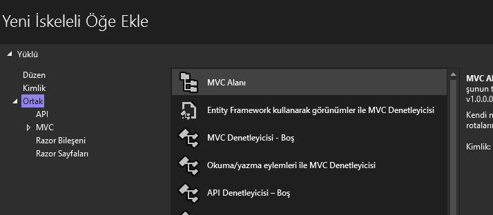

# Web Tabanlı Uygulama Geliştirme Dersi - Asp.NET MVC
Meslek Lisesi - Yazılım Geliştirme Dalı ders içeriğidir. Lise düzeyinde örneklerden oluşur.
## Area Kullanımı
  
  Area (Alan) MVC projesini bölgelere ayırarak farklı farklı login seviyeleri tanımlamak için kullanılır. Örneğin bir kullanıcı yalnız tanımlandığı kullanıcı rolü için izin verilen alana login olabilir.

  MVC projenize area (alan) eklemek için çözüm gezginde proje simgesine sağ tıklayıp, Ekle -> Yeni İskeleli Öğe seçeneğini işaretleyin.
  
  

  Ardından gelen ekrandan MVC Alanı seçeneğini ekleyin
  
 

  Alanınıza bir isim verin. Örneğin "Admin"
  

  Yeni iskeleleli öğe (area) oluşturulduktan sonra, proje ana dizininde Areas isimli bir klasör oluşur. İçerisine açtığınızda oluşturulan alan ile aynı isimde bir klasö, onun içinde de Controllers, Model, Views ve Data isimli klasörler oluştuğunu göreceksiniz. Burada bir alt site oluşmuş durumdadır. yine proje ana dizininde ScaffoldingReamMe.txt isimli bir metin dosyası oluşur bu dosyada, oluşan alana erişmek için gerekli route ayarları verilmiştir. Bu ayarları Program.cs dosyasına eklemeniz gerekir. 

